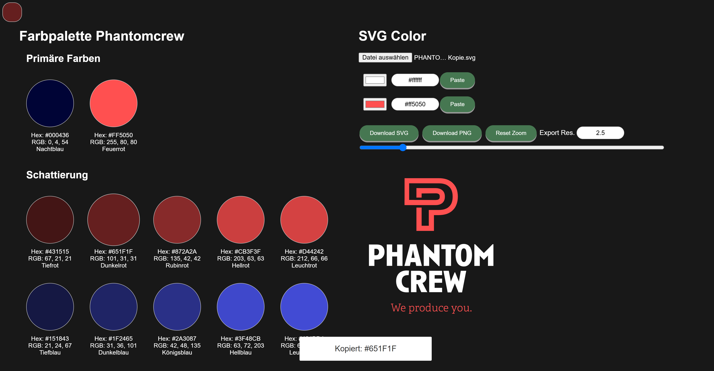

## 🧩 **BrandTint** – Apply Your Brand Colors to SVGs with Ease

**BrandTint** is a lightweight, visual tool for quickly applying corporate or brand color palettes to vector graphics (SVG). Whether you're working on social media assets, presentation slides, or UI mockups — this app helps you stay consistent with your design guidelines and saves time when updating SVGs with your organization's color scheme.

---

### 🎯 Features

* 🎨 Interactive **Phantomcrew Color Palette** viewer
* 📂 Upload your **own SVG** file to preview and recolor
* 🧠 Automatically detects used colors in the SVG (fill, stroke, styles)
* 🧪 Modify colors directly via HEX input or color picker
* 📋 Copy & paste color values with visual feedback
* ⚡ Realtime **contrast checker** with accessibility feedback
* 🔍 Zoom & resolution scaling
* 📤 Download modified SVG or render/export as PNG

---

### 📦 How to Use

1. Open `colorizesvgpallet_Phantom_full.html` in a modern browser.
2. Explore the **color palette** section on the left.
3. Upload your own `.svg` file via the **SVG Color** section.
4. Click any detected color to modify it.
5. Use the **"Paste"** button to apply a selected palette color.
6. Download your modified file as `.svg` or `.png`.

---

### 🚀 Why BrandTint?

* Keeps brand visuals consistent
* Works completely offline
* No installation, no dependencies
* Fast & intuitive for designers and brand managers
* Helps ensure accessible color contrasts

---

### 🔧 Tech

* Pure HTML + CSS + Vanilla JavaScript
* No external libraries required
* Portable: can be hosted on GitHub Pages or any static site

---

### 🖼️ Interface Preview

[Example 1: BrandTint ](https://phantomcrew-de.github.io/BrandTint/colorizesvgpallet_Phantom_full.html) File: `colorizesvgpallet_Phantom_full.html` 

[Example 2: ColorPalette](https://phantomcrew-de.github.io/BrandTint/Farbpalette.html) File: `Farbpalette.html`

 <!-- Replace with a real screenshot -->

### 🧠 Credits

Originally developed for **Phantomcrew**'s corporate identity needs, now open for your adaptation.

---

## 📄 License

This project is licensed under the GNU General Public License v3.0 (GPL-3.0).  
You are free to use, modify, and distribute it — as long as you share your changes under the same license.

### 🤝 Author

Made with ❤️ by Julius – [phantomcrew.de](https://phantomcrew.de/)
  
